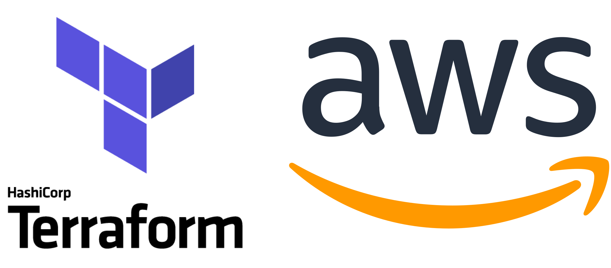
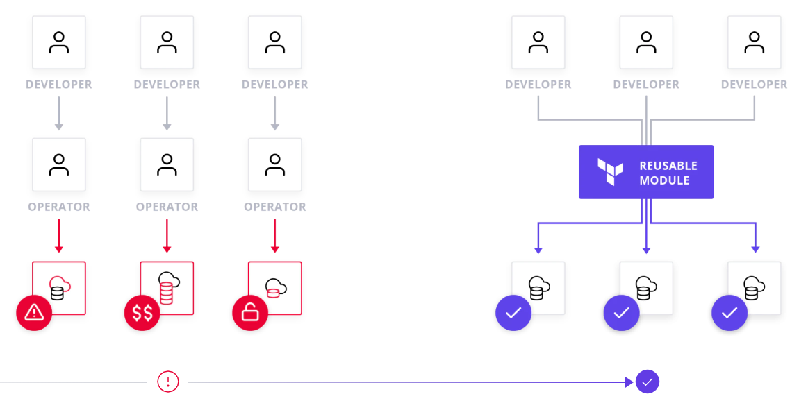
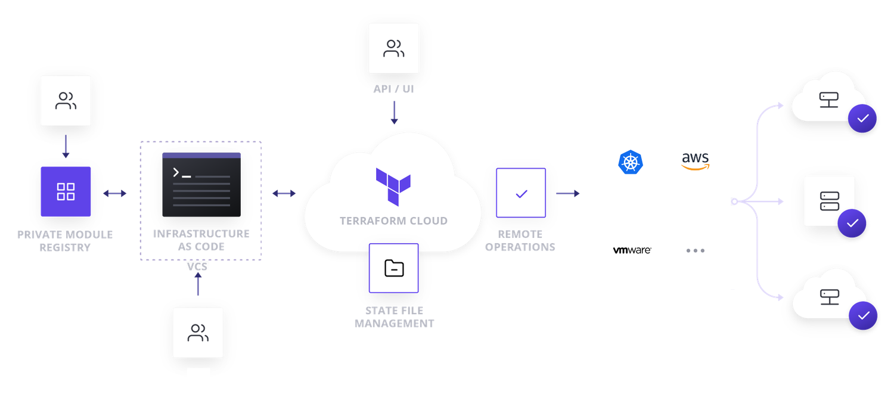
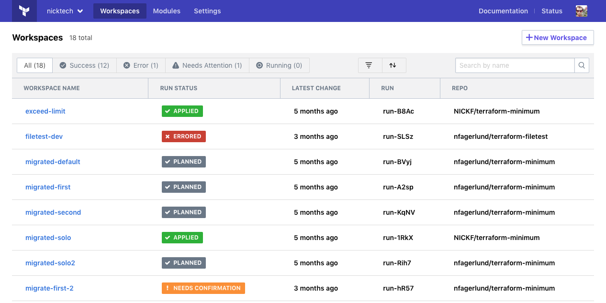
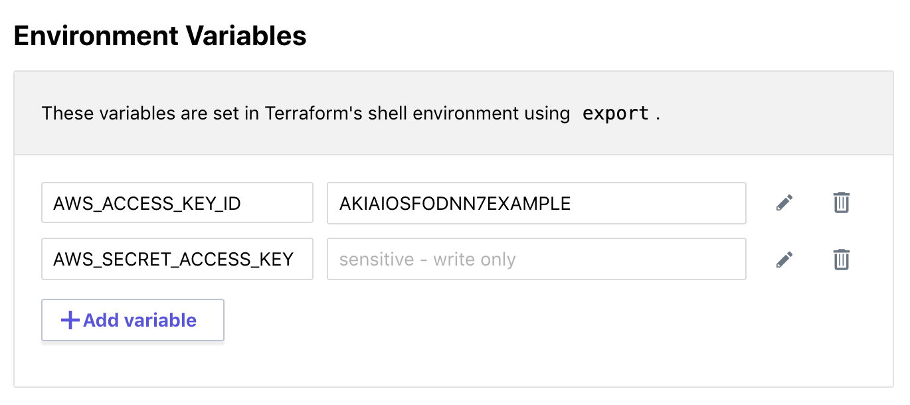
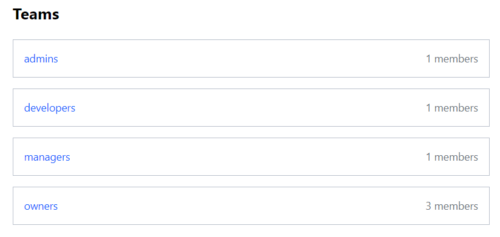

name: Intro-to-Terraform-Cloud
class: center,middle,title-slide
count: false
<br><br>

<br><br>
# Intro to Terraform Cloud on AWS

---
layout: true

.footer[
- Copyright © 2019 HashiCorp
- 
]

---
name: Introductions
# Introductions
- Your Name
- Job Title
- Automation Experience
- Favorite Text Editor

---
name: tfc-link-to-slide-deck
# The Slide Deck
<br><br><br>
.center[
Follow along on your own computer at this link:

# https://git.io/JeNWH
]

---
name: Table-of-Contents
class: col-2
# Table of Contents

<div>
1. OSS to Cloud/Enterprise<br>
🌥️ Terraform Cloud Overview<br>
👨🏽‍🏫 Review the Basics<br>
🔗 Configure Remote State<br>
<hr>
2. Security and RBACs<br>
🔐 Protect Sensitive Variables<br>
🛡️ Work With Access Controls<br>
<hr>
3. VCS & Policy Enforcement<br>
🕸️ Connect to VCS<br>
👬 Collaboration with VCS<br>
👮 Sentinel Policy Enforcement<br>
<hr>
4. Terraform Modules & API<br>
⚙️ Private Module Registry<br>
🏗️ API Driven Workflows<br>
<hr>
5. Extra Resources<br>
⚗️ Bonus Lab<br>
🌐 Useful Links
</div>

---
name: TFE-Chapter-1
class: title

# Chapter 1
## Terraform OSS, Cloud and Enterprise

---
name: terraform-user-journey
# The Terraform User Journey
.center[
<iframe width="560" height="315" src="https://www.youtube.com/embed/FWpCQar9dYg" frameborder="0" allow="accelerometer; autoplay; encrypted-media; gyroscope; picture-in-picture" allowfullscreen></iframe>
]

https://www.hashicorp.com/resources/terraform-adoption-journey

---
name: infrastructure-as-code
class: col-2
# Infrastructure as Code

* Terraform code is written in HCL
* Stop building things by hand
* Put everything into repeatable Terraform configuration
* All build steps are now expressed as code
* If you ever have to rebuild something, it's much easier!


---
name: multi-platform-compliance
# Manage All Your Infrastructure
.center[

]

Terraform also integrates with on premise VMs or platform services.

???
We don't say 'multi-cloud' here out of respect for our hosts.

---
name: self-service-infra
# Self-Service Infrastructure

.center[

]

Enable users to build what they need without running up a huge bill or putting your organization at risk.

---
name: terraform-cloud-what-is-it
# Terraform Cloud - The Big Picture

.center[

]

???
**During the next lab you'll sign up for a free Terraform Cloud account which we'll use for the remainder of this training.**

---
name: why-tfc-1
class: img-right
# Terraform Cloud


Terraform Cloud is a SaaS application that provides the following features:

???
**Until now we've been using only open source features. Sooner or later you'll reach a point where you want more tools for governance and collaboration. Terraform open source is great for small environments and developers, but when you need multiple people or teams to collaborate on the same infrastructure, Terraform Cloud features can help.**

---
name: why-tfc-2
class: img-right
# Terraform Cloud


Terraform Cloud is a SaaS application that provides the following features:

* UI integration with VCS

???
**As your organization begins to standardize on Terraform, you'll have different types of users. Most of you will become terraform experts, but there may be others who just want to build things. They can use the terraform code that folks like you have written. To make this process easy, we have a web application. You log on, click a button, and out pops your infrastructure.**

---
name: why-tfc-3
class: img-right
# Terraform Cloud


Terraform Cloud is a SaaS application that provides the following features:

* UI integration with VCS
* API driven workflows

???
**For our more advanced users we have a fully featured RESTful API. This is useful for programmatic access to terraform features. You can drive terraform plan and apply commands using an API interface. If you have a CI/CD pipeline you can automate your terraform builds as part of your process.**

---
name: why-tfc-4
class: img-right
# Terraform Cloud


Terraform Cloud is a SaaS application that provides the following features:

* UI integration with VCS
* API driven workflows
* Central state management

???
**Terraform enterprise also provides safe and secure storage for your state files. Instead of having that important state file stored on someone's laptop, now it is safely stored in the Terraform Cloud application. Only those who need access to the state file can see it, and it is protected from being overwritten or corrupted.**

---
name: why-tfc-5
class: img-right
# Terraform Cloud


Terraform Cloud is a SaaS application that provides the following features:

* UI integration with VCS
* API driven workflows
* Central state management
* Private Module Registry

???
**Eventually you'll have a library of Terraform code that you might like to share and publish for other users and teams in your company. The private module registry makes this easy. You build reusable modules that build infrastructure according to standards, and then publish them for your users. This can help with enforcing security policies and build standards.**

---
name: why-tfc-6
class: img-right
# Terraform Cloud


Terraform Cloud is a SaaS application that provides the following features:

* UI integration with VCS
* API driven workflows
* Central state management
* Private Module Registry
* Sentinel policy enforcement

???
**TFE also comes with a policy enforcement engine that can ensure that your users don't build things they shouldn't build, or configure them in the wrong way. For example, you might wish to prevent users from opening network ports to the internet, or from building too many virtual machines. All of these types of rules can be expressed using our Sentinel policy enforcement engine. Sentinel policies prevent users from doing bad things, *before* they provision to the cloud.**

---
name: why-tfc-7
class: img-right
# Terraform Cloud


Terraform Cloud is a SaaS application that provides the following features:

* UI integration with VCS
* API driven workflows
* Central state management
* Private Module Registry
* Sentinel policy enforcement
* Single Sign-On

???
**Terraform Enteprise also supports single sign-on using your own SAML provider. This allows you to quickly map users into your organization's teams and workspaces so they can become productive right away.**

---
name: why-tfc-8
class: img-right
# Terraform Cloud


Terraform Cloud is a SaaS application that provides the following features:

* UI integration with VCS
* API driven workflows
* Central state management
* Private Module Registry
* Sentinel policy enforcement
* Single Sign-On
* Secure API credentials

???
**Terraform enterprise can store and encrypt your cloud credentials, passwords or any other sensitive data. These credentials are stored safely inside of a Vault instance that runs inside of TFE.**

---
name: terraform-cloud-enterprise
# Terraform Cloud or Terraform Enterprise?
**[Terraform Cloud](https://app.terraform.io/signup)** is a hosted application that provides features like remote state management, API driven runs, policy management and more. Many users prefer a cloud based SaaS solution because they don't want to maintain the infrastructure to run it.

**[Terraform Enterprise](https://www.hashicorp.com/go/terraform-enterprise)** is the same application, but it runs in your cloud environment or data center. Some users require more control over the Terraform Cloud application, or wish to run it in restricted networks behind corporate firewalls.

The feature list for these two offerings is nearly identical. We will be using Terraform Cloud accounts for our lab exercises today.

---
name: live-demo
class: title, smokescreen, shelf
background-image: url(images/live_demo.jpg)
# Live Demo
## Terraform Cloud in Action

---
name: review-the-basics
class: title, smokescreen, shelf
background-image: url(images/terraform_scifi.jpg)
# Review the Basics
## A Terraform OSS Refresher


---
name: review-basic-terraform-commands
# Terraform Command Review

Let's review some of the most useful terraform commands:

```bash
terraform init    # Initialize the current directory
terraform plan    # Dry run to see what Terraform will do
terraform apply   # Apply the Terraform code and build stuff
terraform destroy # Destroy what was built by Terraform
terraform refresh # Refresh the state file
terraform output  # View Terraform outputs
terraform graph   # Create a DOT-formatted graph
```

---
name: what-is-a-workspace
# Terraform Workspaces
.center[
https://www.terraform.io/docs/cloud/workspaces/
]

A Terraform workspace is simply a managed unit of infrastructure.

???
Explain some more about workspaces and how we view them.

---
name: our-application
# HashiCat Application - Kittens as a Service

.center[]

???
This will be our application for the training today. We've already written all the Terraform code for you. This app will help us learn how different features work.

---
name: terraform-state
class: title, smokescreen, shelf
background-image: url(images/checklist.jpg)
# Terraform State
## Infrastructure Lifecycle Management

---
name: tf-state-file
# Terraform State
```tex
  "primary": {
      "id": "i-0413fe5b4509d65b1",
      "attributes": {
          "ami": "ami-06f2f779464715dc5",
```

Terraform stores information about the resources it has built in a **state file**. This important file contains all of the data that Terraform needs to change, update, and delete infrastructure.

By default, the state file is stored in your local workspace.

---
name: why-not-local-state
class: img-left-full
# Oops, I Lost My State File


The local state file has some disadvantages:

* Sometimes contains secrets or sensitive data
* Can't collaborate because the file is on someone's laptop
* Risk of losing or deleting the state file
* No centralized record keeping

---
name: tfcloud-remote-state
# Terraform Cloud Remote State
Terraform Cloud Remote State is free and available to all users. The requirements to get it set up and working are below.

* Free or paid Terraform Cloud account
* A **`.terraformrc`** (Unix/Linux) or **`terraform.rc`** (Windows) config file
* User access token stored in your config file
* Remote backend config file. We name it **`remote_backend.tf`** for consistency.

**WARNING** - do not copy your Terraform Cloud API token to github!

https://www.terraform.io/docs/backends/types/remote.html

???
Please raise your right hand and repeat after me:

"I will never store credentials in my terraform workspace."

---
name: lab-exercise-0
# 👩‍💻 Getting Started with Instruqt
<br><br>
[Instruqt](https://instruqt.com) is the HashiCorp training platform. Visit the link below for a short tutorial, or if you're already familiar with Instruqt you can skip to the next slide.

[https://instruqt.com/instruqt/tracks/getting-started-with-instruqt](https://instruqt.com/instruqt/tracks/getting-started-with-instruqt)

---
name: lab-exercise-1
# 👩‍💻 Lab Exercise: Configure Remote State
<br><br>
In this lab you'll set up a free Terraform Cloud account and configure your account for remote execution of Terraform commands.

Your instructor will provide the URL for the first lab environment.

🛑 **STOP** after you complete the first quiz.

---
name: TFE-Chapter-2
class: title
# Chapter 2
## Security and Role-Based Access Controls

---
name: securing-sensitive-vars
class: title, smokescreen, shelf
background-image: url(images/secure_lock.jpg)
# Sensitive Variables
## A Secure Place for API Credentials

---
name: Security-and-Compliance
# Did you know?
Thousands of API and cryptographic keys are leaked to GitHub every day!

https://nakedsecurity.sophos.com/2019/03/25/thousands-of-coders-are-leaving-their-crown-jewels-exposed-on-github/

>"I think efforts like GitHub’s Token Scanning project should be applauded, but they are only effective once a leak has already occurred. This problem also is likely not isolated to GitHub – it will affect any publicly available code. We need more research to develop systems that help developers avoid this mistake in the first place."

---
name: Protecting-Sensitive-Variables
# Protecting Sensitive Variables

---
name: where-are-your-creds
# Where Are Your API Keys?
Terraform requires credentials in order to communicate with your cloud provider's API. These API keys should never, ever be stored directly in your terraform code. Config files and environment variables are a better option, but the credentials still live on your workstation, usually stored in plaintext.

---
name: a-better-way-creds
# A Better Way to Store Sensitive Data

Terraform Cloud can safely store your credentials and encrypt them for you. You can use this encrypted storage for passwords, TLS Certificates, SSH keys or anything else that should not be lying around in plain text.

.center[]

---
name: terraform-teams
class: title, smokescreen, shelf
background-image: url(images/teamwork.png)
# Terraform Cloud Teams
## Role-Based Access Controls (RBAC)

---
name: terraform-rbac-2
# Teams for Terraform Collaboration

---
name: terraform-rbac
# Role Based Access Controls (RBAC)
.center[]

Terraform Cloud is a multi-tenanted application that supports fine-grained access controls. You can create multiple organizations, each containing its own teams and users.

---
name: lab-exercise-2
# 👩‍💻 Lab Exercise: Secure Variables and RBACs
<br><br>
In this lab you'll learn how to store and encrypt sensitive variables and set up role-based access controls (RBACs).

Continue the lab exercises from where you left off.

🛑 **STOP** after you complete the second quiz.

---
name: TFE-Chapter-3
class: title

# Chapter 3
## Version Control and Sentinel Policies

---
name: version-control-title
class: title, smokescreen, shelf
background-image: url(images/git_log.png)
# Terraform With VCS
## Version Control Systems

---
name: whats-a-vcs
# What is a Version Control System (VCS)?
Version control systems are applications that allow users to store, track, test, and collaborate on changes to their infrastructure and applications. Terraform Cloud integrates with most common Version Control Systems.

---
name: tfc-infra-as-code-workflow
# Infrastructure as Code
<br><br>
Terraform Cloud can directly integrate with source code repos in GitHub Enteprise, Gitlab, and Bitbucket. This allows you to build simple DevOps workflows with code reviews, testing and approvals.

---
name: vcs-driven-workflow
# Automated Test Pipelines
.center[]

When your Terraform code is stored in a version control system, you unlock extra features like pull requests, code reviews and testing. Here's an example showing some tests that run on our training lab repo.

---
name: everything-is-recorded
# No More Untracked Changes

---
name: multi-user-collaboration
# Collaborate With Other Users

---
name: audit-trail-for-infra
# Audit Trail for Infrastructure Builds

---
name: sentinel-policy-enforcement
class: title, smokescreen, shelf
background-image: url(images/security_lasers.jpg)
# Sentinel
## Policy Enforcement for Terraform

---
name: what-is-sentinel
# What is Sentinel?
```hcl
# Restricting region in AWS
aws_region_valid = rule {
  all region_values as rv {
	rv == "us-east-1"
  }
}
```

Sentinel is HashiCorp's policy enforcement language. Sentinel policies are checked after **`terraform plan`** is run. Sentinel will intercept bad configurations *before* they go to production, not after.

---
name: what-can-sentinel-do
# Example Uses for Sentinel

---
name: sentinel-enforcement-levels
# Sentinel Enforcement Levels

---
name: org-or-workspace
# Apply to Organization or Workspaces

---
name: lab-exercise-3
# 👩‍💻 Lab Exercise: Version Control and Sentinel
<br><br>
In this lab we'll cover Version Control System (VCS) integration and Sentinel Policy Enforcement.

Continue the lab exercises from where you left off.

🛑 **STOP** after you complete the third quiz.

---
name: TFE-Chapter-4
class: title

# Chapter 4
## Modules and API Automation

---
name: private-module-registry
class: title, smokescreen, shelf
background-image: url(images/lego_wallpaper.jpg)
# Terraform Modules
## Reusable Infrastructure as Code

---
name: what-even-is-module
# What is a Terraform Module?

---
name: how-modules-configured
# How are Terraform Modules Configured?

---
name: private-module-registry
class: img-right
# Private Module Registry


Terraform modules are reusable packages of Terraform code that you can use to build your infrastructure.

Terraform Cloud includes a Private Module Registry where you can store, version, and distribute modules to your organizations and teams.

---
name: api-driven-workflows
class: title, smokescreen, shelf
background-image: url(images/enter_the_matrix.jpg)
# Terraform Cloud API
## Automate Everything

---
name: whats-an-api
# Application Programming Interface

---
name: terraform-cloud-api
# Terraform Cloud API - How It Works

---
name: api-use-cases
# Terraform Cloud API - Use Cases

---
name: TFE-Chapter-5
class: title

# Chapter 5
## Bonus Lab & Extra Resources

---
name: additional-resources-tfe
# Additional Resources
If you'd like to learn more about Terraform Enterprise or Terraform Cloud visit the links below:

Terraform Enterprise Product Page
https://www.hashicorp.com/products/terraform/

Why Consider Terraform Enterprise Over Open Source?
https://www.hashicorp.com/resources/why-consider-terraform-enterprise-over-open-source

Terraform AWS Provider Documentation
https://www.terraform.io/docs/providers/aws/

---
name: Feedback-Survey
# Workshop Feedback Survey
<br><br>
.center[
Your feedback is important to us!

The survey is short, we promise:

# http://bit.ly/hashiworkshopfeedback
]

---
name: the-end
class: img-caption

# Congratulations, you completed the workshop!

